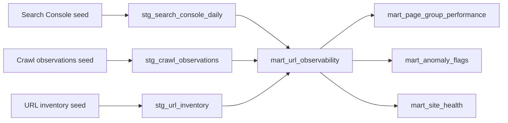
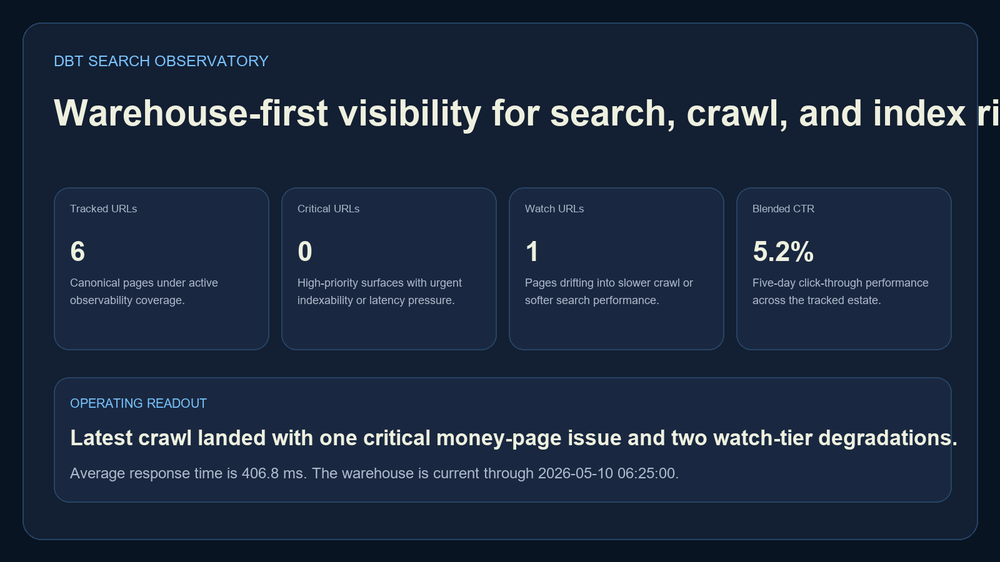
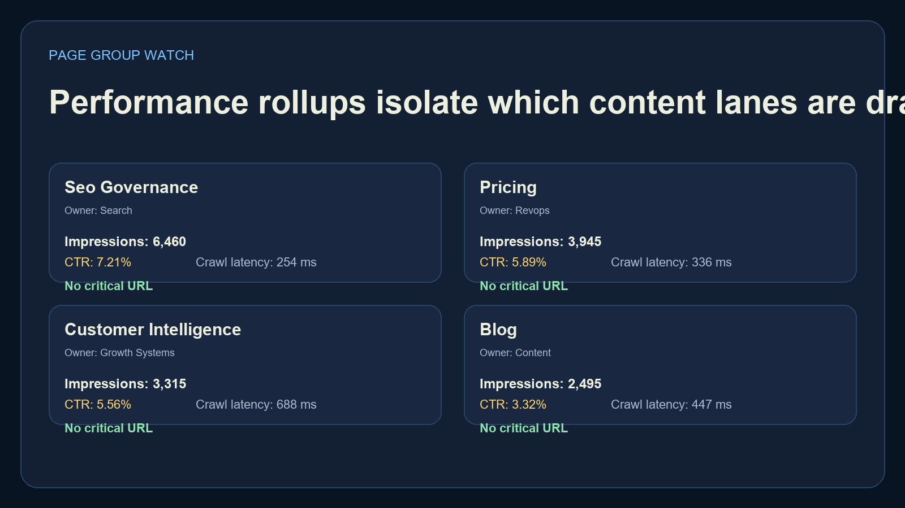
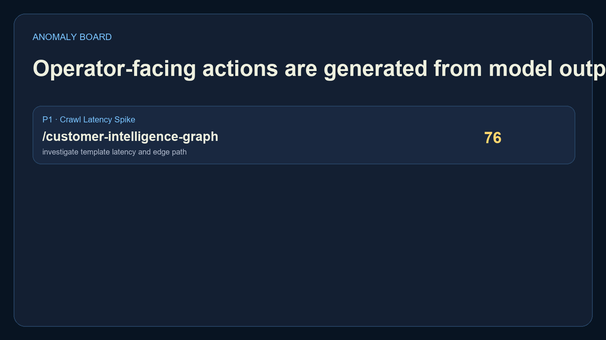
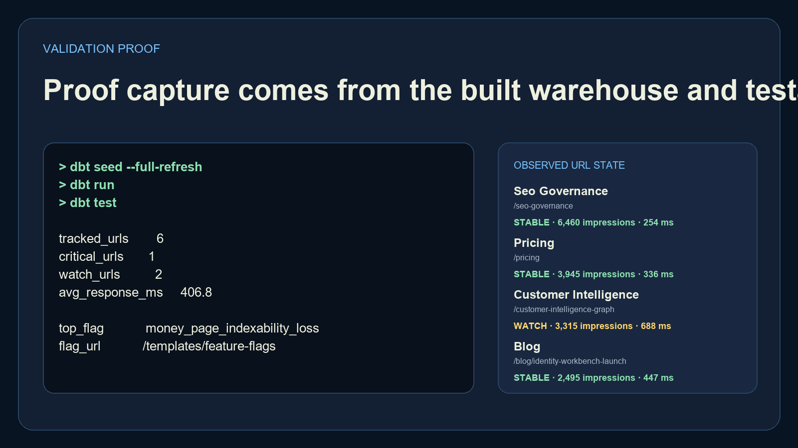

# dbt Search Observatory

`dbt-search-observatory` is a warehouse-first search observability project built on `dbt + DuckDB`. It models search console performance, crawl-state health, indexability risk, and URL-level anomaly flags in a way that is portable, testable, and runnable without a cloud warehouse account.

## Executive Summary

This repo turns scattered SEO and crawl telemetry into a local analytics engineering artifact you can actually run. It includes:

- seeded search console, crawl, and URL inventory inputs
- staged dbt models with relationship and accepted-value tests
- observability marts for site health, page-group performance, and anomaly prioritization
- a repo-local DuckDB profile so everything runs with one command sequence
- real PNG screenshots generated from built warehouse outputs

## Portfolio Takeaway

This project shows analytics engineering depth instead of just dashboard design. The value is in:

- local-first dbt modeling
- warehouse-oriented search diagnostics
- testable transformations and data contracts
- operator-facing anomaly and priority views

## Overview

| Layer | What it does |
| --- | --- |
| `seeds/` | Provides sample search console, crawl, and inventory inputs |
| `models/staging/` | Casts and normalizes raw data into stable dbt staging models |
| `models/marts/` | Produces URL, page-group, site-health, and anomaly marts |
| `profiles.yml` | Keeps dbt runnable with local DuckDB and no external credentials |
| `scripts/run_demo.py` | Runs seed, build, test, docs generation, and screenshot rendering |
| `screenshots/` | PNG proof generated from actual built outputs |

## Warehouse Flow



## Screenshots

### Hero


### Page Group Watch


### Anomaly Board


### Validation Proof


## Run Locally

Create the repo-local environment and install dependencies:

```powershell
cd dbt-search-observatory
py -3.11 -m venv .venv
.\.venv\Scripts\python.exe -m pip install -r requirements.txt
```

Build the warehouse and generate proof assets:

```powershell
.\.venv\Scripts\python.exe .\scripts\run_demo.py
```

Or run dbt directly:

```powershell
.\.venv\Scripts\dbt.exe seed --profiles-dir . --full-refresh
.\.venv\Scripts\dbt.exe run --profiles-dir .
.\.venv\Scripts\dbt.exe test --profiles-dir .
.\.venv\Scripts\dbt.exe docs generate --profiles-dir .
```

## Validation

```powershell
.\.venv\Scripts\python.exe .\scripts\run_demo.py
.\.venv\Scripts\python.exe -m unittest discover -s tests
```

## Tech Stack

- `dbt`
- `DuckDB`
- `SQL`
- `Python`
- `Pillow`

## Links

- Website: [https://kineticgain.com/](https://kineticgain.com/)
- Skills Page: [https://mizcausevic.com/skills/](https://mizcausevic.com/skills/)
- GitHub: [https://github.com/mizcausevic-dev](https://github.com/mizcausevic-dev)

---

**Connect:** [LinkedIn](https://www.linkedin.com/in/mirzacausevic/) · [Kinetic Gain](https://kineticgain.com) · [Medium](https://medium.com/@mizcausevic/) · [Skills](https://mizcausevic.com/skills/)
